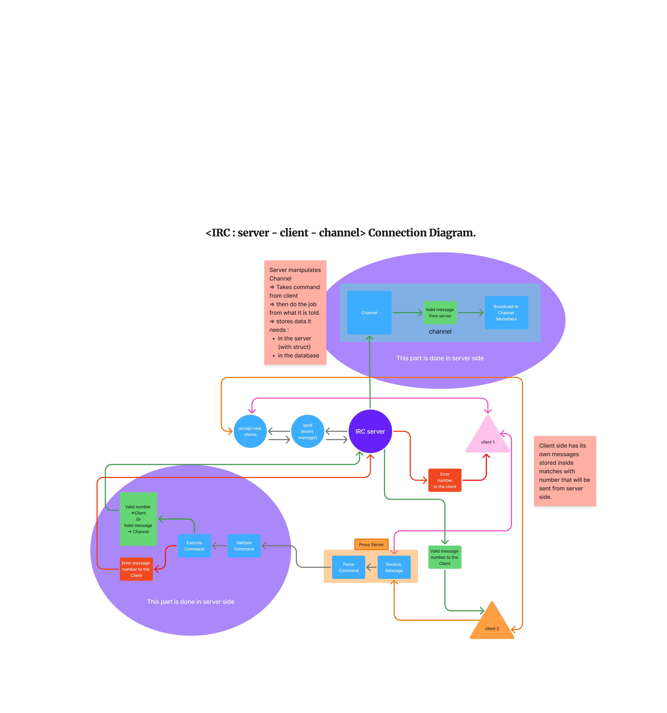

# ft_irc - High-Performance IRC Server

A production-ready IRC (Internet Relay Chat) server implementation written in C++17, featuring a scalable event-driven architecture with non-blocking I/O and comprehensive protocol support.

## 📌 At a Glance

**Tech Stack**: C++17 | epoll | CMake | Google Test  
**Architecture**: Event-driven, Non-blocking I/O, Proxy Pattern  
**Key Features**: Multi-client concurrent handling, Channel management, IRC protocol compliance  
**Team Size**: 3 members

## 🚀 Key Highlights

- **High-Performance Architecture**: Event-driven design using epoll for efficient concurrent connection handling
- **Full IRC Protocol Compliance**: Complete implementation of core IRC commands with proper error handling
- **Scalable Design**: Non-blocking I/O architecture capable of handling thousands of concurrent connections
- **Robust Channel Management**: Advanced channel modes (invite-only, key-protected, user limits, topic protection)
- **Modern C++17**: Leverages smart pointers, RAII, and modern C++ best practices
- **Comprehensive Testing**: Extensive test suite with unit, integration, and stress tests

## 🏗️ Architecture

The server follows a layered architecture with clear separation of concerns, implementing a proxy pattern for message processing:

### Request Flow

```
Client → Accept New Clients (epoll) → Proxy Server → Server Side Processing → Response
                                    ↓
                            [Receive Message]
                                    ↓
                            [Parse Command]
                                    ↓
                            [Validate Command]
                                    ↓
                            [Execute Command]
                                    ↓
                    ┌───────────────┴───────────────┐
                    ↓                               ↓
            Valid Message                    Error Message
                    ↓                               ↓
        ┌───────────┴───────────┐                   ↓
        ↓                       ↓                   ↓
    To Client              To Channel         Error to Client
        ↓                       ↓
    Direct Send          Broadcast to Members
```

### Core Components

#### **Proxy Server Layer** (Message Processing)
- **ConnectionManager**: Manages client lifecycle, receives raw messages, and handles disconnections
- **MessageParser**: Parses incoming IRC messages according to RFC 1459 protocol specifications
- **CommandRunner**: Validates and executes IRC commands with proper error handling

#### **Server Core**
- **EventLoop**: Epoll-based event loop for non-blocking I/O operations (Linux) with fallback to poll
- **SocketManager**: Handles socket creation, binding, and connection acceptance
- **ClientIndex**: Efficient client registration and lookup using file descriptor indexing
- **ChannelManager**: Channel creation, lookup, and lifecycle management
- **PongManager**: Connection health monitoring with automatic timeout detection

#### **Data Layer**
- **Client**: Per-client state management with message buffering for chunked message handling
- **Channel**: Channel state, member management, and broadcast operations

### Connection Flow Diagram


*Figure: Complete IRC server-client-channel connection flow showing the interaction between clients, proxy server, and server-side processing*

The diagram illustrates:
- **Client-side message buffering** with numbered message matching
- **Proxy Server layer** handling message reception and command parsing
- **Server-side validation and execution** with proper error handling
- **Channel broadcasting** mechanism for multi-client communication

## 💡 Technical Highlights

### Event-Driven Architecture
- **epoll-based I/O**: Utilizes Linux epoll for O(1) event notification, enabling efficient handling of thousands of concurrent connections
- **Non-blocking Sockets**: All socket operations are non-blocking, preventing thread blocking
- **Message Buffering**: Client-side message buffering handles chunked messages and partial reads gracefully

### Protocol Implementation
- **IRC RFC 1459 Compliance**: Full support for standard IRC protocol commands
- **Error Handling**: Comprehensive error responses following IRC numeric reply codes
- **Message Validation**: Multi-layer validation (access control, parameter validation, format checking)

### Performance Optimizations
- **Zero-copy Message Processing**: Efficient string handling and minimal memory allocations
- **O(1) Client Lookup**: Fast client retrieval using file descriptor indexing
- **Efficient Broadcasting**: Optimized channel member iteration for message broadcasting
- **Connection Pooling**: Automatic cleanup of disconnected clients and empty channels

## 📦 Building and Installation

### Prerequisites

- CMake 3.10 or higher
- C++17 compatible compiler (GCC 7+, Clang 5+)

### Build Instructions

```bash
# Clone the repository
git clone https://github.com/yourusername/ft_irc.git
cd ft_irc

# Build with CMake
mkdir build && cd build
cmake ..
make

# Run tests (optional)
make test
```

## Usage

### Running the Server

```bash
# Basic usage
./ft_irc <port> <password>

# Example
./ft_irc 6667 serverpassword

# Default settings (port 6667, password "42")
./ft_irc
```

### Connecting with a Client

Use any standard IRC client (irssi, hexchat, etc.) to connect:

```
/server localhost 6667
/pass serverpassword
/nick yournickname
/user username 0 * :Your Real Name
```

## 📋 Supported Commands

<details>
<summary><b>Channel Operations</b> (Click to expand)</summary>

- **JOIN**: Join channels with optional key authentication
- **PART**: Leave channels with optional reason
- **TOPIC**: View and modify channel topics (with mode protection)
- **MODE**: Configure channel modes (invite-only, key, user limit, topic protection, operator status)
- **KICK**: Remove users from channels (operator-only)
- **INVITE**: Invite users to invite-only channels
</details>

<details>
<summary><b>Messaging & User Operations</b> (Click to expand)</summary>

- **PRIVMSG/NOTICE**: Send messages to users or channels
- **NICK/USER/QUIT**: User registration and management
- **PING/PONG**: Connection health checks
- **CAP/MOTD**: Server capability negotiation
</details>

## 🔐 Channel Modes

| Mode | Description | Parameter |
|------|-------------|-----------|
| `+i` | Invite only | No |
| `+t` | Topic protection | No |
| `+k` | Channel key | Yes |
| `+l` | User limit | Yes |
| `+o` | Operator status | Yes |

## 🧪 Testing

Comprehensive test suite with Google Test framework covering unit, integration, and stress tests.

```bash
cd build && make test
```

**Coverage**: Unit tests, integration tests, message handling (chunked/oversized), edge cases, stress tests, protocol compliance

## 🔧 Development

### Project Structure
```
ft_irc/
├── src/
│   ├── server/      # Core server components
│   ├── proxy/        # Message parsing and command routing
│   ├── channel/     # Channel management
│   ├── commands/    # IRC command implementations
│   └── utils/       # Utility functions
├── include/         # Header files
└── tests/           # Test suite
```

### Key Design Decisions
- **RAII**: Automatic resource management for sockets and connections
- **Smart Pointers**: Memory safety with `std::unique_ptr` and `std::shared_ptr`
- **Error Handling**: Custom exception hierarchy for different error types
- **Platform Abstraction**: EventLoop factory pattern for cross-platform support

## 👥 Contributors

- [Wassaaa](https://github.com/wassaaa)
- [LeonorTu](https://github.com/LeonorTu)
- [Stella-Kwon](https://github.com/Stella-Kwon)

---

**Built with ❤️ using C++17 and modern software engineering practices**
